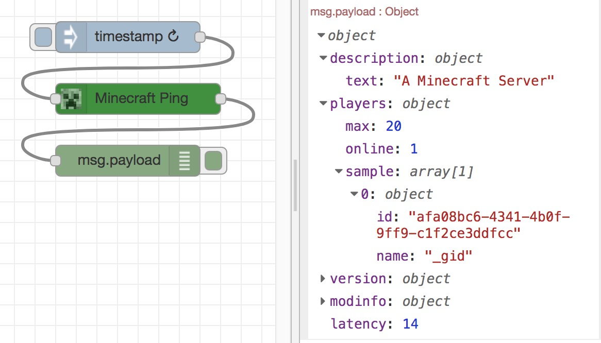

# node-red-contrib-minecraft-ping

A Node-RED node that pings a Minecraft server to see if my daughter
is _still_ logged-in.

This simple node uses the [Minecraft ping
protocol](https://github.com/PrismarineJS/node-minecraft-protocol) to get
a list of _sample_ players logged-in to a server, and the number of
players.  As I understand it, this is not guaranteed to contain all (if
any) players, but I think this simple _"ping"_ API can be achieved without
a full server login, and for a small private server will probably deliver
the required information... it certainly does what _I_ need it to do.

I use this node with a repeating _Inject_ node and then filter the payload
using a _Function_ node to check and time specific users, updating
_MQTT_ for consumption by other devices.

This node is simple, but could be forked and extended to provide a much
larger interface to Minecraft.  See
[node-minecraft-protocol](https://github.com/PrismarineJS/node-minecraft-protocol)
for the more-extensive JavaScript API.

As ever, improvements welcome.  I do suggest, however, that if you want to
increase the functionality significantly, you fork this project as
`node-red-contrib-minecraft-query` or another name, and keep _this_ node
simple to use.

## Note on styling

I've deviated from the recommended white/transparent icon for the node;
I'm usually a stickler for standards, but the iconic Creeper face is just
too irresistable to ignore.  There are a few alternative icons that can be
overridden in the _"Appearance"_ panel for the node; just search for
_minecraft_.

